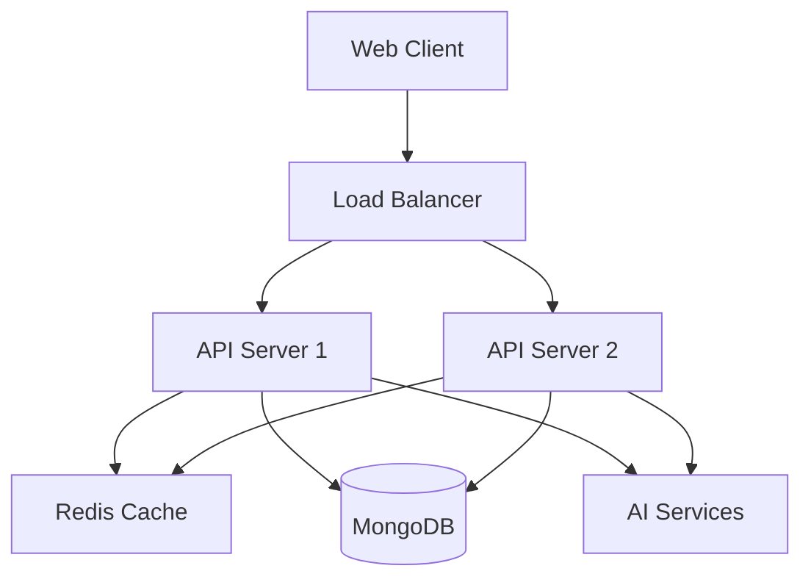
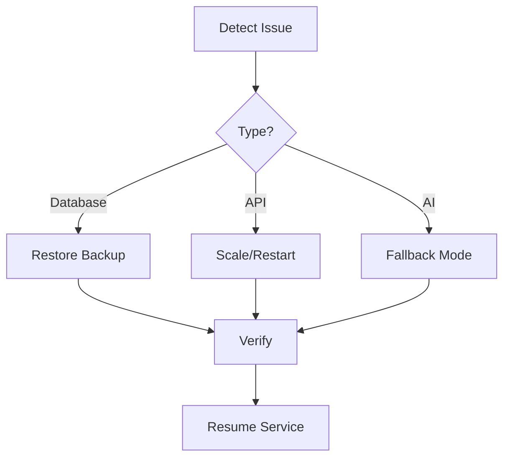

# AI Writing Platform - Deployment & Monitoring Guide

## Deployment Architecture

### Infrastructure Overview


## Deployment Process

### 1. Environment Setup

#### Production Environment Variables
```bash
# Backend (.env.production)
NODE_ENV=production
PORT=3001
MONGODB_URI=mongodb://production-db:27017/ai_writing
REDIS_URL=redis://cache:6379
GOOGLE_AI_API_KEY=your_production_key
T5_MODEL_PATH=/opt/models/t5
LOG_LEVEL=info
```

#### Container Configuration
```yaml
# docker-compose.production.yml
version: '3.8'
services:
  frontend:
    build:
      context: ./frontend
      dockerfile: Dockerfile.production
    ports:
      - "80:80"
    environment:
      - REACT_APP_API_URL=https://api.aiwriting.com

  backend:
    build:
      context: ./backend
      dockerfile: Dockerfile.production
    ports:
      - "3001:3001"
    environment:
      - NODE_ENV=production
    volumes:
      - ai-models:/opt/models

  mongodb:
    image: mongo:latest
    volumes:
      - mongodb-data:/data/db

  redis:
    image: redis:alpine
    volumes:
      - redis-data:/data

volumes:
  mongodb-data:
  redis-data:
  ai-models:
```

### 2. Deployment Commands

#### Build and Deploy
```bash
# Build containers
docker-compose -f docker-compose.production.yml build

# Deploy
docker-compose -f docker-compose.production.yml up -d

# Scale services
docker-compose -f docker-compose.production.yml up -d --scale backend=3
```

#### Database Migration
```bash
# Run migrations
npm run migrate:production

# Verify database
npm run db:verify
```

## Monitoring Setup

### 1. Application Monitoring

#### Prometheus Configuration
```yaml
# prometheus.yml
global:
  scrape_interval: 15s

scrape_configs:
  - job_name: 'ai-writing-platform'
    static_configs:
      - targets: ['localhost:3001']
    metrics_path: '/metrics'
```

#### Grafana Dashboards
```json
{
  "dashboard": {
    "panels": [
      {
        "title": "API Response Time",
        "type": "graph"
      },
      {
        "title": "AI Model Performance",
        "type": "gauge"
      },
      {
        "title": "Error Rate",
        "type": "alert-list"
      }
    ]
  }
}
```

### 2. Performance Monitoring

#### Key Metrics
```typescript
interface PerformanceMetrics {
  // API Performance
  responseTime: {
    p50: number;
    p95: number;
    p99: number;
  };

  // Resource Usage
  memory: {
    used: number;
    total: number;
    percentage: number;
  };

  // AI Performance
  aiLatency: {
    gemini: number;
    t5: number;
  };

  // Cache Performance
  cacheHitRate: number;
}
```

#### Alerting Rules
```yaml
groups:
  - name: ai-writing-alerts
    rules:
      - alert: HighResponseTime
        expr: http_request_duration_seconds > 2
        for: 5m
        
      - alert: HighErrorRate
        expr: rate(http_requests_total{status=~"5.."}[5m]) > 0.1
        for: 5m
        
      - alert: LowCacheHitRate
        expr: cache_hit_ratio < 0.7
        for: 15m
```

### 3. Error Tracking

#### Error Logging
```typescript
interface ErrorLog {
  timestamp: string;
  level: 'error' | 'warn' | 'info';
  message: string;
  stack?: string;
  context: {
    userId?: string;
    requestId: string;
    path: string;
    method: string;
  };
}
```

#### Log Aggregation
```bash
# Filebeat configuration
filebeat.inputs:
- type: log
  paths:
    - /var/log/ai-writing/*.log

output.elasticsearch:
  hosts: ["elasticsearch:9200"]
```

## Scaling Strategy

### 1. Horizontal Scaling
```bash
# Scale API servers
kubectl scale deployment backend --replicas=5

# Scale cache
kubectl scale statefulset redis --replicas=3
```

### 2. Cache Configuration
```typescript
interface CacheConfig {
  // TTL for different types of data
  ttl: {
    suggestions: number;    // 1 hour
    analysis: number;      // 2 hours
    userProfile: number;   // 24 hours
  };

  // Maximum cache size
  maxSize: {
    memory: string;        // "2gb"
    entries: number;       // 10000
  };

  // Eviction policy
  evictionPolicy: 'lru' | 'lfu';
}
```

## Backup Strategy

### 1. Database Backups
```bash
# Daily backup
mongodump --uri="$MONGODB_URI" --out=/backups/$(date +%Y%m%d)

# Restore from backup
mongorestore --uri="$MONGODB_URI" /backups/20250704/
```

### 2. AI Model Backups
```bash
# Backup models
tar -czf /backups/models-$(date +%Y%m%d).tar.gz /opt/models/

# Restore models
tar -xzf /backups/models-20250704.tar.gz -C /opt/models/
```

## Disaster Recovery

### 1. Recovery Plan


### 2. Fallback Modes
```typescript
interface FallbackMode {
  // Use cached results
  useCache: boolean;

  // Use simpler analysis
  basicMode: boolean;

  // Skip AI features
  skipAI: boolean;

  // Maximum retry attempts
  maxRetries: number;
}
```

## Security Measures

### 1. API Security
```typescript
interface SecurityConfig {
  // Rate limiting
  rateLimit: {
    window: number;     // 15 minutes
    max: number;        // 100 requests
  };

  // API Key requirements
  apiKey: {
    required: boolean;
    roles: string[];
  };

  // CORS configuration
  cors: {
    origins: string[];
    methods: string[];
  };
}
```

### 2. Data Protection
```typescript
interface DataProtection {
  // Encryption at rest
  encryption: {
    algorithm: string;
    keyRotation: number;
  };

  // Data retention
  retention: {
    userContent: number;  // 90 days
    analytics: number;    // 30 days
  };
}
```

Remember to regularly update these configurations based on system requirements and performance metrics.